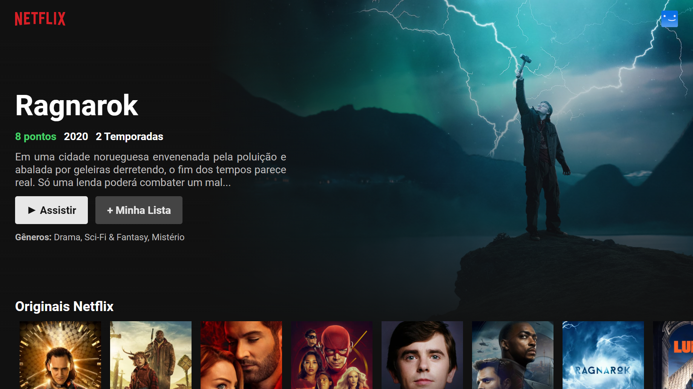

<h1 align="center">
  <a href="https://github.com/PitzTech/suno-movies"></a>
</h1>

<blockquote align="center">“Sucesso não é o resultado de um jogo, mas o destino de uma jornada”!</blockquote>

<p align="center">
  <a href="#-tecnologias">Tecnologias</a>&nbsp;&nbsp;&nbsp;|&nbsp;&nbsp;&nbsp;
  <a href="#-projeto">Projeto</a>&nbsp;&nbsp;&nbsp;|&nbsp;&nbsp;&nbsp;
  <a href="#-em-desenvolvimento">Em desenvolvimento</a>&nbsp;&nbsp;&nbsp;|&nbsp;&nbsp;&nbsp;
  <a href="#-como-usar">Como usar</a>&nbsp;&nbsp;&nbsp;|&nbsp;&nbsp;&nbsp;
  <a href="#memo-licença">Licença</a>
</p>

<p align="center">
 

  
</p>

<br>

<p align="center">
   
</p>

<h3 align="justify">
	Uma plataforma de filmes construida durante o desafio técnico do processo seletivo da Suno. Baseada em ReactJS, Typescript, Styled Components e TMDB API.
</h3>

## 🚀 Tecnologias

Esse projeto foi desenvolvido com as seguintes tecnologias:

-  HTML
-  CSS
-  Typescript
-  ReactJS
-  Axios
-  Styled Components
-  TMDB API
-  Context API
-  Functional Components

## 💻 Projeto

Esse projeto visa codificar a interface desenvolvida pela equipe de UI/UX. Criando assim, uma plataforma de filmes, onde é possivel:

-  **Receber indicações de filmes** (Carrossel com ordem randômica)
-  **Filtrar por categorias** (Em construção)
-  **Ver mais informações dos filmes**, em página própria
-  **Buscar por filmes** (Em construção)

## 🚧 Em desenvolvimento

Esse projeto encontra-se em desenvolvimento, sendo previsto a criação dos seguintes recursos:

-  Seletor Customizado
-  Indicação baseada nos gêneros mais acessados
-  Filtrar por categorias
-  Responsividade
-  Busca por filmes

## 👷 Como usar

<p>Você irá precisar dessas instalar essas ferramentas:</p>

-  [Node.js](https://nodejs.org/en/ "Node.js")
-  [Yarn](https://yarnpkg.com/ "Yarn")
-  [Git](https://git-scm.com/ "Git")

Para executar basta rodar os seguintes comandos:

```bash
# Clone this repository
$ git clone https://github.com/PitzTech/suno-movies

# Go into the folder of the project
$ cd suno-movies

# Install the dependencies
$ yarn

# Start the client
$ yarn start

```

## :memo: Licença

Esse projeto está sob a licença MIT. Veja o arquivo [LICENSE](LICENSE.md) para mais detalhes.

---

Projeto concluido com ♥ by PitzTech:wave:
<br>
Direitos de imagem Suno

<p align="center">
  <a href="https://www.linkedin.com/in/victor-laurentino-do-nascimento/"></a>
  &nbsp;&nbsp;&nbsp;&nbsp;
  <a href="mailto:victorlaurentino7@gmail.com?subject=Oi%20Victor!%20Vim%20do%20seu%20GitHub"></a>
  &nbsp;&nbsp;&nbsp;&nbsp;
  <a href="https://www.linkedin.com/in/victor-laurentino-do-nascimento/"></a>
</p>
